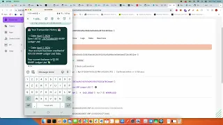

# [Bongo](https://www.bongo.cash/) - Redefine Mobile Money.

## Powered by 

At Bongo, we are redefining **Mobile Money** by providing a way transfer funds through **SMS** on top of the XRP Ledger Blockchain.

## DEMO

[](https://www.youtube.com/embed/X1wFc1a9A38?si=lCkEnb2ckEEyqvX8)

### Demo Stack

- [Mistral AI](https://mistral.ai/) - Automation and optimization platform for wind farms, utilizing machine learning for enhanced efficiency.

- [HTTP SMS with Twilio](https://httpsms.com/) - Send and receive SMS messages over HTTP using Httpsms robust SMS API.

- [Ethers.js](https://docs.ethers.io/v5/) - Ethereum blockchain interaction library, supporting wallet management, transactions, and smart contracts.

- [Express](https://expressjs.com/) - Minimalist web framework for Node.js, ideal for building web applications and APIs efficiently.

- [Supabase](https://supabase.com/) - Open-source Firebase alternative providing databases, auth, real-time subscriptions, and storage with RESTful and GraphQL APIs.

## Features

- **UX Friendly**: Bongo is a user-friendly platform, which means that the users can easily navigate through the platform on his phone with text only.

- **Compliant**: Bongo is a compliant platform, which means all our users are verified and have passed the KYC process to ensure the safety of the platform and full compliance with the regulations in place.

- **Cost Efficient**: Bongo is a platform that makes Cross-Border Payments easy and cost efficient.

# Preview

The app is deployed on Vercel and can be accessed at [https://www.bongo.cash/](https://www.bongo.cash/)

## Getting started

Install dependencies

```bash
pnpm i
```

Copy `.env.example` to `.env.local` and set the environment variables

## Deployed Contracts on XRPL EVM Side Chain

| CONTRACTS                              | ADDRESSES                                  |
| -------------------------------------- | ------------------------------------------ |
| Bongo Smart Wallet Contract (Treasury) | 0x49502A4f3705cb4F831343712be619898A8B528F |
| Mockup Stablecoin                      | 0x41E79b67A978Da5f6Ecb67b40C5AAF45159f1D5f |
| Bongo Cash Voucher Contract            | 0xb564d63Ecd9B42B740Aab49fea38daeDEd2Eb734 |

## Stack

- [Next.js](https://nextjs.org/)
- [TypeScript](https://www.typescriptlang.org/)
- [Tailwind CSS](https://tailwindcss.com/)
- [XRPL Ledger EVM Side Chain](https://xrpl.org/docs/concepts/xrpl-sidechains/)

## Authors

- [Magicred-1](https://github.com/Magicred-1/)
- [Marco75116](https://github.com/Marco75116)
- [Lucas Perreira.](https://github.com/deucalionn)
- Elia Kemp.
